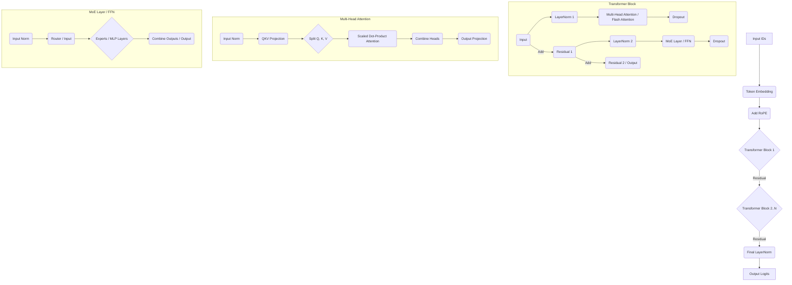

# XenArcAI-v2: Rebuilt Large Language Model Architecture

This project is a rebuilt version of the XenArcAI concept, focusing on a clean, modular implementation using JAX/Flax for training large language models, potentially leveraging TPU infrastructure.

## Project Goals
- Provide a clear and maintainable codebase for a large transformer-based language model.
- Implement core components like multi-head attention, Mixture of Experts (MoE), and Rotary Position Embeddings (RoPE).
- Utilize efficient data pipelines (currently using `tf.data` with a dummy example).
- Leverage JAX/Flax for high-performance training, especially on TPUs.
- Incorporate best practices for configuration, training loops, and checkpointing.

## Current Status
- Core model architecture (`src/model.py`) implemented using Flax.
- Data pipeline (`src/data_pipeline.py`) set up using `tf.data` (with a dummy dataset).
- Training script (`src/train.py`) implemented with JAX, Optax, and Orbax checkpointing.
- Configuration managed via dataclasses (`config/config.py`).
- Basic project structure and dependencies (`requirements.txt`) defined.

## Structure
```
XenArcAI-v2/
├── config/
│   └── config.py         # Configuration dataclasses
├── src/
│   ├── __init__.py
│   ├── data_pipeline.py  # Data loading and preprocessing
│   ├── model.py          # Model definition (Transformer, MoE, RoPE)
│   └── train.py          # Main training script
├── tests/
│   ├── __init__.py
│   └── test_model.py     # (Placeholder for tests)
├── data_placeholder/     # Placeholder for actual data files
├── checkpoints/          # Default directory for model checkpoints
├── logs/                 # Default directory for training logs
├── README.md             # This file
└── requirements.txt      # Python dependencies
```

## Architecture Overview

The model follows a standard Transformer architecture with modifications like Rotary Position Embeddings (RoPE) and optional Mixture of Experts (MoE) layers.



## Setup
1.  **Clone the repository:**
    ```bash
    git clone <repository_url> # Replace with actual URL if hosted
    cd XenArcAI-v2
    ```
2.  **Create a virtual environment (recommended):**
    ```bash
    python -m venv venv
    source venv/bin/activate  # On Windows use `venv\Scripts\activate`
    ```
3.  **Install dependencies:**
    ```bash
    pip install -r requirements.txt
    # Ensure you have the correct JAX version for your hardware (CPU/GPU/TPU)
    # See: https://github.com/google/jax#installation
    ```
4.  **Prepare Data:**
    - Replace the dummy data pipeline in `src/data_pipeline.py` with your actual data loading logic (e.g., using `datasets.load_dataset` or reading from files).
    - Update `config/config.py` (`DataConfig`) with the correct paths or identifiers for your dataset and ensure the `tokenizer_name` matches the tokenizer used for your data (e.g., 'gpt2', 'bert-base-uncased', or a path to a local tokenizer). The pipeline uses `transformers.AutoTokenizer` to load the specified tokenizer.

## Usage
Run the training script:
```bash
python src/train.py
```
Configuration options can be modified in `config/config.py`.

## Future Work
- Implement full Flash Attention (requires custom kernels or specific libraries).
- Enhance the MoE implementation (e.g., capacity factor, load balancing).
- Add comprehensive unit and integration tests.
- Integrate with experiment tracking tools (e.g., Weights & Biases, TensorBoard).
- Develop scripts for inference/generation.
- Add support for loading configuration from YAML files or command-line arguments.

## License
## Contributing
Contributions are welcome! Please feel free to submit a Pull Request or open an Issue.

(Optional: Add more detailed contribution guidelines, e.g., code style, testing requirements).

## License
This project is licensed under the MIT License - see the [LICENSE](LICENSE) file for details.
